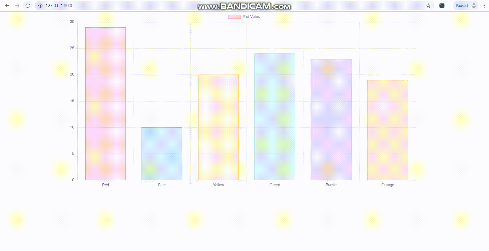

# Dynamic Graph 
Simple project to make a real time graph display using Chart.js and Django.

This project has moved to dynamically update the contents when the user refreshes the page.   
   
### AJAX can be applied in the graph.

### Dynamic_bar_graph is the django project name and only application used in this project is named as main. Main contains the applications views, urls, etc for dynamic content change.

To make it work in your system, change the template path in **dynamic_bar_graph/dynamic_bar_graph/settings.py**

#### Python automatically generates a list of 6 integers and make the graph value change over each refresh.

#### Put all the html,css and js files inside the templates folder and work inside it.

